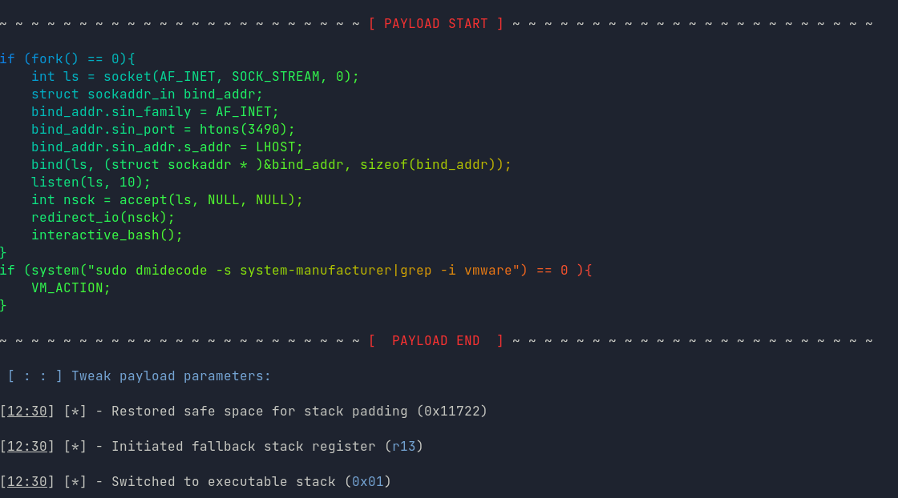

<h1 align="center"> Revenant </h1>  

  

  

 &nbsp;&nbsp;&nbsp;&nbsp;&nbsp;&nbsp;&nbsp;&nbsp;&nbsp;&nbsp;&nbsp;&nbsp;&nbsp;&nbsp;&nbsp;&nbsp;&nbsp;&nbsp;&nbsp;&nbsp;&nbsp;&nbsp;&nbsp;&nbsp;&nbsp;&nbsp;&nbsp;&nbsp;&nbsp;&nbsp;&nbsp;&nbsp;&nbsp;&nbsp;&nbsp; &nbsp;&nbsp;&nbsp;&nbsp;&nbsp;&nbsp;&nbsp;&nbsp;&nbsp;&nbsp;    &nbsp;&nbsp;&nbsp;&nbsp;&nbsp;&nbsp;&nbsp;    &nbsp;&nbsp;&nbsp;&nbsp;&nbsp;&nbsp;&nbsp;&nbsp;&nbsp; 

 &nbsp;&nbsp;&nbsp;&nbsp;&nbsp;&nbsp;&nbsp;&nbsp;&nbsp;&nbsp;&nbsp;&nbsp;&nbsp;&nbsp;&nbsp;&nbsp;&nbsp;&nbsp;&nbsp;&nbsp;&nbsp;&nbsp;&nbsp;&nbsp;&nbsp;&nbsp;&nbsp;&nbsp;&nbsp;&nbsp;&nbsp;&nbsp;&nbsp;&nbsp;  &nbsp;&nbsp;&nbsp;&nbsp; 
 &nbsp;&nbsp;&nbsp;&nbsp;
 &nbsp;&nbsp;&nbsp;&nbsp; 
 

 

# Intro
This tool combines [SCC runtime](https://scc.binary.ninja), [rofi](https://github.com/davatorium/rofi), [Msfvenom](https://www.offensive-security.com/metasploit-unleashed/Msfvenom/), [Ngrok](ngrok.com)
and a dynamic template processor, offering an easy to use interface for compiling custom, highly evasive ELF payloads for testing Linux ecosystems.
Automatic integration with Metasploit Framework Console offers infinite prototypying possibilities.

# Usage
Simply install all required dependencies using `apt-get` or any other package manager.
Running `./install.sh` should usually suffice.
Issuing `./revenant.sh` afterwards will start a TUI session.

# Features
 * Free code composition from templates - every C fragment is self-contained; can be placed anywhere within the source.
 * Responsive, fast TUI.
 * Non-standard payloads for daemonization/IPC, pingbacks, system mapping, data exfiltration, persistence, process priority manipulation, mutexes, networking etc.
 * Powerful macro processor - forget about complex hex conversions or constantly looking up your machine's address - all context-specific variables are filled automatically.
 * Extended bad characters removal from generated binary blob.
 * Integration with reverse TCP tunnels.
 * Ideal for both `stage0` and `stage1+` delivery strategy thanks to a raw Assembly dropper.
 * Generic command stagers if no SO/BO-based vuln is present, yet Remote Command Execution was identified as a possible entrypoint.
 * Highly automated encoding and encryption, including random combination of encoders thanks to `scc` and `msf` flexibility.
 * Anti-disassembly techniques - random breakpoint/syscall insertion every X instructions.
 * Optional power source detector to restrict payload's operativeness to servers and workstations.
 * A general purpose CIDR lock for the similar purpose as power source detector.
 * Not a Metasploit fan? The initialization of the framework can be disabled after the ELF compilation, leaving you just with a freshly baked binary file.
 * A wide range of sandbox/virtualization detection methods, with customizable action triggers when VM check returns `true`. _Some of them are quite new_
 * NOP sled (canonical/non-canonical) and junk data padding can be enabled to increase polymorphism and reliability in less stable exploits.
 * Crafted source in C is opened in default editor before compilation to enable easy changes and fixes.
 

# Screenshots
<h2 align="center"> Main dialog </h1>  

  

 
<h2 align="center"> Compiler with Metasploit importer </h1>  

  

 
<h2 align="center"> Available C fragments </h1>  

  

 
 
<h2 align="center"> Payload creation interface </h1>  

  

 
<h2 align="center"> Log window </h1>  

  

# Example TUI session 
img/ui.mkv

# Ngrok setup
Please make sure to fill the pool of authtokens inside `tokens.txt` before issuing a tunneled connection.

# Full version
If interested in the Full or Enterprise version of the framework, please [contact us](https://redcodelabs.io/#contact)

